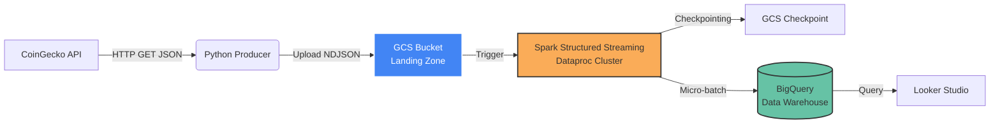

# 🚀 End-to-End Real-time Crypto Data Pipeline on GCP

> A scalable, low-latency streaming pipeline that ingests live crypto market data, processes it via Spark on Dataproc, and visualizes trends in real-time.

## 🏛 Architecture & Data Flow

This project implements the **File-based Streaming (Landing Zone)** pattern to decouple ingestion from processing, ensuring high availability and fault tolerance.

## 📊 Real-time Dashboard Demo

Visualizing live price movements (BTC, ETH, ...) using Logarithmic Scale.

## 🛠 Tech Stack
  
  **Ingestion:**           Python (Custom Producer), Google Cloud Storage (Staging).

  **Processing:**          Apache Spark Structured Streaming (Dataproc).

  **Warehouse:**           Google BigQuery (Partitioned Tables).

  **Visualization:**       Looker Studio.
  
## 💡 Key Technical Challenges & Solutions

### 1. Handling API Rate Limits & Data Quality

-   **Challenge:** The CoinGecko API restricts the number of requests
    and occasionally returns error messages instead of JSON data, which
    could crash the pipeline.
-   **Solution:** Implemented a robust **Python Producer** with
    `try-except` blocks and `time.sleep()` backoff strategies. Added
    data validation (`isinstance(info, dict)`) to filter out bad
    responses before ingestion.

### 2. Dependency Hell & Connector Issues

-   **Challenge:** The standard Spark-PubSub connector was
    deprecated/unavailable for the specific Spark version on Dataproc.
-   **Solution:** Pivoted to a **File-based Streaming Architecture**
    using GCS as a trigger. This native Spark approach removed external
    dependency risks and simplified the debugging process (since raw
    files are readable in the bucket).

### 3. Fault Tolerance

-   **Challenge:** Ensuring the streaming job can resume after a failure
    without losing data.
-   **Solution:** Configured Spark **Checkpointing** in GCS. This allows
    the job to track processed files (`offsets`) and resume exactly
    where it left off in case of a cluster restart.

---

<strong>🏃‍♂️ Click here to see "How to Run"</strong>

### Prerequisites

* GCP Account (Dataproc, BigQuery, GCS enabled).
* Google Cloud SDK installed.

### Quick Start

1. **Setup Infra:**
bash gsutil mb -l us-central1 gs://YOUR_BUCKET_NAME/ bq mk --location=us-central1 streaming_dataset
3. **Run Producer:**
bash pip install google-cloud-storage requests python producer_file.py
4. **Submit Spark Job:**
bash gcloud dataproc jobs submit pyspark spark_streaming_files.py \ --cluster=spark-streaming-cluster \ --region=us-central1 \ --project=YOUR_PROJECT_ID

